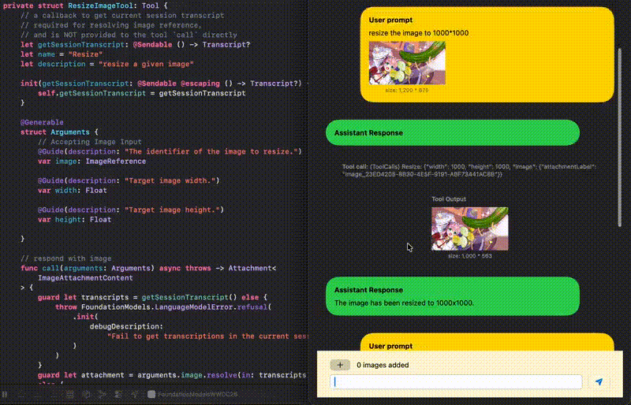

# Swift: FoundationModel + Image (WWDC26/OS27+)
A demo of working with images using foundation model, including passing in images as input, accepting those as tool call parameters, and output images from the tools.

For more details, please check out my blog [Swift/WWDC26: Images Finally Made To FoundationModels](https://medium.com/@itsuki.enjoy/swift-wwdc26-images-finally-made-to-foundationmodels-271b5a7935ef)

